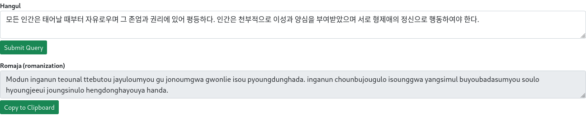

# Soli
The Soli system is an improved method for converting Korean hangul into its Latin equivalent. Try [Hangul-Romaja Converter](https://7ae.github.io/soli).

## Preview

## Features

There are two main systems for the romanization of Korean: Revised Romanization of Korean and McCune–Reischauer. However, they are difficult to read and write to Koreans and foreigners.

- Soli translates each hangul to a single consistent Latin spelling, whereas RR and MR sometimes transcribe hangul into more than one spelling due to pronunciation variations in Korean:

Hangul | Soli | RR/MR
--- | --- | ---
신라 | sinla | silla, shilla, silra, shinra
종로 | jonglo | jongro, jongno, jokro, jokno
떡볶이 | ttogboki | tteokbokki, ttokppokki, topokki, toppogi

- Soli assigns consistent Latin letters to hangul consonants, whereas RR and MR assign inconsistent Latin letters depending on whether hangul consonants come at the beginning or end of a word: ㄱ, ㄷ, ㄹ and ㅂ are transcribed as _g, d, r, b_ at the beginning of a word, and as _k, t, l, p_ at the end of a word.
- Soli merges indistinguishable vowels into the same Latin spelling: ㅜ/ㅡ _u_, ㅐ/ㅔ _e_, ㅒ/ㅖ _ye_, ㅙ/ㅚ/ㅞ _oe_ and ᅱ/ᅴ _ui_. By contrast, RR adds an a or e to certain vowels: ㅡ _eu_, ㅐ _ae_ and ᅫ _wae_. This is confusing and leads people to misread ㅡ as _eh-u_ and ㅐ as _ah-eh_.
- Soli doesn't contain diacritics, hyphens and apostrophes.
  - Hangul: 한글
     Soli: Hangul
     RR/MR: Hangeul, Han'gŭl, Han-geul

### Exceptions
- ㅅ, ㅈ, ㅊ, ㅎ are pronounced as _t_ if not followed by a vowel: 낮 na**j** → na**t**, 햇빛 he**s**bi**ch** → he**t**bi**t**
- Soli rules may be ignored for the name of a person, company or organization.

## Hangul Jamo
### Vowels

<table>
  <thead>
    <tr align=center>
      <th>Hangul</th>
      <th>Soli</th>
      <th>RR</th>
      <th>MR</th>
      <th>Yale</th>
    </tr>
  </thead>
  <tbody>
    <tr align=center>
      <td>ㅏ</td>
      <td colspan=4>a</td>
    </tr>
    <tr align=center>
      <td>ㅑ</td>
      <td colspan=4>ya</td>
    </tr>
    <tr align=center>
      <td>ㅓ</td>
      <td>o</td>
      <td>eo</td>
      <td>ŏ</td>
      <td>e</td>
    </tr>
    <tr align=center>
      <td>ㅕ</td>
      <td>yo</td>
      <td>yeo</td>
      <td>yŏ</td>
      <td>ye</td>
    </tr>
    <tr align=center>
      <td>ㅗ</td>
      <td colspan=3>o</td>
      <td>(w)o</td>
    </tr>
    <tr align=center>
      <td>ㅛ</td>
      <td colspan=4>yo</td>
    </tr>
    <tr align=center>
      <td>ㅜ</td>
      <td colspan=3>u</td>
      <td>wu</td>
    </tr>
    <tr align=center>
      <td>ㅠ</td>
      <td colspan=4>yu</td>
    </tr>
    <tr align=center>
      <td>ㅡ</td>
      <td>u</td>
      <td>eu</td>
      <td>ŭ</td>
      <td>u</td>
    </tr>
    <tr align=center>
      <td>ㅣ</td>
      <td colspan=4>i</td>
    </tr>
    <tr align=center>
    <td colspan=5></td>
    </tr>
    <tr align=center>
      <td>ㅐ</td>
      <td rowspan=2>e</td>
      <td colspan=2>ae</td>
      <td>ay</td>
    </tr>
    <tr align=center>
      <td>ㅔ</td>
      <td colspan=2>e</td>
      <td>ey</td>
    </tr>
    <tr align=center>
      <td>ㅒ</td>
      <td rowspan=2>ye</td>
      <td colspan=2>yae</td>
      <td>yay</td>
    </tr>
    <tr align=center>
      <td>ㅖ</td>
      <td colspan=2>ye</td>
      <td>yey</td>
    </tr>
    <tr align=center>
      <td>ㅙ</td>
      <td rowspan=3>oe</td>
      <td colspan=2>wae</td>
      <td>way</td>
    </tr>
    <tr align=center>
      <td>ㅚ</td>
      <td colspan=2>oe</td>
      <td>(w)oy</td>
    </tr>
    <tr align=center>
      <td>ㅞ</td>
      <td>ue</td>
      <td>we</td>
      <td>wey</td>
    </tr>
    <tr align=center>
      <td>ㅘ</td>
      <td colspan=4>wa</td>
    </tr>
    <tr align=center>
      <td>ㅝ</td>
      <td colspan=2>wo</td>
      <td>wŏ</td>
      <td>we</td>
    </tr>
    <tr align=center>
      <td>ㅟ</td>
      <td rowspan=2>ui</td>
      <td colspan=3>wi</td>
    </tr>
    <tr align=center>
      <td>ㅢ</td>
      <td colspan=3>uy</td>
    </tr>
  </tbody>
</table>

### Consonants

<table>
  <thead>
    <tr align=center>
      <th>Hangul</th>
      <th>Soli</th>
      <th>RR</th>
      <th>MR</th>
      <th>Yale</th>
    </tr>
  </thead>
  <tbody>
    <tr align=center>
      <td>ㄱ</td>
      <td>g</td>
      <td>g/k</td>
      <td>k/g</td>
      <td>k</td>
    </tr>
    <tr align=center>
      <td>ㄴ</td>
      <td colspan=4>n</td>
    </tr>
    <tr align=center>
      <td>ㄷ</td>
      <td>d</td>
      <td>d/t</td>
      <td>t/d</td>
      <td>t</td>
    </tr>
    <tr align=center>
      <td>ㄹ</td>
      <td>l</td>
      <td colspan=2>r/l</td>
      <td>l</td>
    </tr>
    <tr align=center>
      <td>ㅁ</td>
      <td colspan=4>m</td>
    </tr>
    <tr align=center>
      <td>ㅂ</td>
      <td>b</td>
      <td>b/p</td>
      <td>p/b</td>
      <td>p</td>
    </tr>
    <tr align=center>
      <td>ㅅ</td>
      <td colspan=4>s</td>
    </tr>
    <tr align=center>
      <td>ㅇ</td>
      <td colspan=4>-/ng</td>
    </tr>
    <tr align=center>
      <td>ㅈ</td>
      <td colspan=2>j</td>
      <td>ch/j</td>
      <td>c</td>
    </tr>
    <tr align=center>
      <td>ㅊ</td>
      <td colspan=2>ch</td>
      <td>ch'</td>
      <td>ch</td>
    </tr>
    <tr align=center>
      <td>ㅋ</td>
      <td colspan=2>k</td>
      <td>k'</td>
      <td>kh</td>
    </tr>
    <tr align=center>
      <td>ㅌ</td>
      <td colspan=2>t</td>
      <td>t'</td>
      <td>th</td>
    </tr>
    <tr align=center>
      <td>ㅍ</td>
      <td colspan=2>p</td>
      <td>p'</td>
      <td>ph</td>
    </tr>
    <tr align=center>
      <td>ㅎ</td>
      <td colspan=4>h</td>
    </tr>
    <tr align=center>
      <td colspan=5></td>
    </tr>
    <tr align=center>
      <td>ㄲ</td>
      <td>k</td>
      <td colspan=3>kk</td>
    </tr>
    <tr align=center>
      <td>ㄸ</td>
      <td colspan=4>tt</td>
    </tr>
    <tr align=center>
      <td>ㅃ</td>
      <td colspan=4>pp</td>
    </tr>
    <tr align=center>
      <td>ㅆ</td>
      <td>s</td>
      <td colspan=3>ss</td>
    </tr>
    <tr align=center>
      <td>ㅉ</td>
      <td colspan=2>jj</td>
      <td>tch</td>
      <td>cc</td>
    </tr>
  </tbody>
</table>

## Usage
- Hangul: 콩고물과 우유가 들어간 빙수는 차게 먹어야 특별한 맛이 잘 표현된다
 Soli: Konggomulgwa uyuga dulogan bingsunun chage mogoya tugbyolhan masi jal pyohyondoenda
- Hangul: 참나무 타는 소리와 야경만큼 밤의 여유를 표현해 주는 것도 없다
 Soli: Chamnamu tanun soliwa yagyongmankum bamui yoyulul pyohyonhe junun gotdo obtda
- Hangul: 모든 인간은 태어날 때부터 자유로우며 그 존엄과 권리에 있어 평등하다. 인간은 천부적으로 이성과 양심을 부여받았으며 서로 형제애의 정신으로 행동하여야 한다.
 Soli: Modun inganun teonal ttebuto jayuloumyo gu jonomgwa gwonlie iso pyongdunghada. inganun chonbujogulo isonggwa yangsimul buyobadasumyo solo hyongjeeui jongsinulo hengdonghayoya handa.

- Cities

Hangul | Soli | Hangul | Soli | Hangul | Soli | Hangul | Soli | Hangul | Soli
:---: | :---: | :---: | :---: | :---: | :---: | :---: | :---: | :---: | :---:
서울 | Soul | 부산 | Busan | 인천 | Inchon | 대구 | Degu | 대전 | Dejon
광주 | Gwangju | 수원 | Suwon | 울산 | Ulsan | 춘천 | Chunchon | 제주 | Jeju

- List of regions and provinces

  - 관북 Gwanbug 
  &nbsp;1. 함북 Hambug
  - 관남 Gwannam 
  &nbsp;2. 함남 Hamnam
  - 관서 Gwanso 
  &nbsp;3. 평북 Pyongbug 
  &nbsp;4. 평남 Pyongnam
  - 해서 Heso 
  &nbsp;5. 황해 Hwanghe
  - 수도권 Sudogwon 
  &nbsp;6. 경기 Gyonggi
  - 관동 Gwandong 
  &nbsp;7. 강원 Gangwon
  - 호서 Hoso 
  &nbsp;8. 충북 Chungbug 
  &nbsp;9. 충남 Chungnam
  - 호남 Honam 
  &nbsp;10. 전북 Jonbug 
  &nbsp;11. 전남 Jonnam
  - 영남 Yongnam 
  &nbsp;12. 경북 Gyongbug 
  &nbsp;13. 경남 Gyongnam
  - 제주 Jeju 
  &nbsp;14. 제주 Jeju

- Address
  - Hangul: 서울특별시 서초구 반포대로 59 101동 501호 (서초동, 서초아파트 자이)
   Soli: Banpodelo 59 Apt 101-501 (Sochodong, Socho Apartment Jai), Sochogu, Soul, Korea
  - Hangul: 서울특별시 서초구 반포대로 23길 6 (서초동)
   Soli: Banpodelo 23 Gil 6 (Sochodong), Sochogu, Soul, Korea
