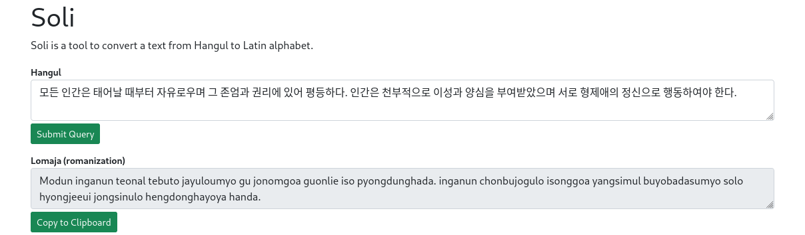

# Soli

Soli is a romanization system for easily writing Hangul with Latin letters.

## Preview

## Features

There are two primary systems for romanizing Korean: the Revised Romanization of Korean and McCune–Reischauer. However, they can be challenging to read and write for both native Koreans and Korean learners.

- Soli makes things simpler by giving each Hangul character a single, consistent Latin spelling. In contrast, RR and MR sometimes transcribe Hangul into multiple spellings due to different ways of pronouncing it in Korean.

| Hangul | Soli    | Other Variations                         |
| ------ | ------- | ---------------------------------------- |
| 신라   | sinla   | silla, shilla, silra, shinra             |
| 종로   | jonglo  | jongro, jongno, jokro, jokno             |
| 떡볶이 | togboki | tteokbokki, ttokppokki, topokki, toppogi |

- Soli gives Hangul consonants a consistent Latin representation. In contrast, RR and MR use different Latin letters for Hangul consonants depending on whether they're at the beginning or end of a word. For example, ㄱ, ㄷ, ㄹ, and ㅂ are transcribed as g, d, r, b at the start, and k, t, l, p at the end.
- Soli simplifies things by using the same Latin spelling for similar vowels: ㅜ/ㅡ become u, ㅐ/ㅔ become e, ㅒ/ㅖ become ye, ㅙ/ㅚ/ㅞ become oe, and ᅱ/ᅴ become ui. In contrast, RR adds 'a' or 'e' to certain vowels: ㅡ becomes eu, ㅐ becomes ae, and ᅫ becomes wae. This can be confusing and cause people to misread ㅡ as eh-u and ㅐ as ah-eh.
- Soli keeps things straightforward without diacritics, hyphens, or apostrophes.
  - Hangul: 한글
     Soli: Hangul
     RR/MR: Hangeul, Han'gŭl, Han-geul

### Exceptions

- When ㅅ, ㅈ, ㅊ, or ㅎ are not followed by a vowel, they sound like t: 낮 naj → nat, 햇빛 hesbich → hetbit

## Hangul Jamo

### Vowels

<table>
  <thead>
    <tr align=center>
      <th>Hangul</th>
      <th>Soli</th>
      <th>RR</th>
      <th>MR</th>
      <th>Yale</th>
    </tr>
  </thead>
  <tbody>
    <tr align=center>
      <td>ㅏ</td>
      <td colspan=4>a</td>
    </tr>
    <tr align=center>
      <td>ㅑ</td>
      <td colspan=4>ya</td>
    </tr>
    <tr align=center>
      <td>ㅓ</td>
      <td>o</td>
      <td>eo</td>
      <td>ŏ</td>
      <td>e</td>
    </tr>
    <tr align=center>
      <td>ㅕ</td>
      <td>yo</td>
      <td>yeo</td>
      <td>yŏ</td>
      <td>ye</td>
    </tr>
    <tr align=center>
      <td>ㅗ</td>
      <td colspan=3>o</td>
      <td>(w)o</td>
    </tr>
    <tr align=center>
      <td>ㅛ</td>
      <td colspan=4>yo</td>
    </tr>
    <tr align=center>
      <td>ㅜ</td>
      <td colspan=3>u</td>
      <td>wu</td>
    </tr>
    <tr align=center>
      <td>ㅠ</td>
      <td colspan=4>yu</td>
    </tr>
    <tr align=center>
      <td>ㅡ</td>
      <td>u</td>
      <td>eu</td>
      <td>ŭ</td>
      <td>u</td>
    </tr>
    <tr align=center>
      <td>ㅣ</td>
      <td colspan=4>i</td>
    </tr>
    <tr align=center>
    <td colspan=5></td>
    </tr>
    <tr align=center>
      <td>ㅐ</td>
      <td rowspan=2>e</td>
      <td colspan=2>ae</td>
      <td>ay</td>
    </tr>
    <tr align=center>
      <td>ㅔ</td>
      <td colspan=2>e</td>
      <td>ey</td>
    </tr>
    <tr align=center>
      <td>ㅒ</td>
      <td rowspan=2>ye</td>
      <td colspan=2>yae</td>
      <td>yay</td>
    </tr>
    <tr align=center>
      <td>ㅖ</td>
      <td colspan=2>ye</td>
      <td>yey</td>
    </tr>
    <tr align=center>
      <td>ㅙ</td>
      <td rowspan=3>oe</td>
      <td colspan=2>wae</td>
      <td>way</td>
    </tr>
    <tr align=center>
      <td>ㅚ</td>
      <td colspan=2>oe</td>
      <td>(w)oy</td>
    </tr>
    <tr align=center>
      <td>ㅞ</td>
      <td>ue</td>
      <td>we</td>
      <td>wey</td>
    </tr>
    <tr align=center>
      <td>ㅘ</td>
      <td>oa</td>
      <td colspan=3>wa</td>
    </tr>
    <tr align=center>
      <td>ㅝ</td>
      <td>uo</td>
      <td>wo</td>
      <td>wŏ</td>
      <td>we</td>
    </tr>
    <tr align=center>
      <td>ㅟ</td>
      <td rowspan=2>ui</td>
      <td colspan=3>wi</td>
    </tr>
    <tr align=center>
      <td>ㅢ</td>
      <td colspan=3>uy</td>
    </tr>
  </tbody>
</table>

### Consonants

<table>
  <thead>
    <tr align=center>
      <th>Hangul</th>
      <th>Soli</th>
      <th>RR</th>
      <th>MR</th>
      <th>Yale</th>
    </tr>
  </thead>
  <tbody>
    <tr align=center>
      <td>ㄱ</td>
      <td>g</td>
      <td>g/k</td>
      <td>k/g</td>
      <td>k</td>
    </tr>
    <tr align=center>
      <td>ㄴ</td>
      <td colspan=4>n</td>
    </tr>
    <tr align=center>
      <td>ㄷ</td>
      <td>d</td>
      <td>d/t</td>
      <td>t/d</td>
      <td>t</td>
    </tr>
    <tr align=center>
      <td>ㄹ</td>
      <td>l</td>
      <td colspan=2>r/l</td>
      <td>l</td>
    </tr>
    <tr align=center>
      <td>ㅁ</td>
      <td colspan=4>m</td>
    </tr>
    <tr align=center>
      <td>ㅂ</td>
      <td>b</td>
      <td>b/p</td>
      <td>p/b</td>
      <td>p</td>
    </tr>
    <tr align=center>
      <td>ㅅ</td>
      <td colspan=4>s</td>
    </tr>
    <tr align=center>
      <td>ㅇ</td>
      <td colspan=4>-/ng</td>
    </tr>
    <tr align=center>
      <td>ㅈ</td>
      <td colspan=2>j</td>
      <td>ch/j</td>
      <td>c</td>
    </tr>
    <tr align=center>
      <td>ㅊ</td>
      <td colspan=2>ch</td>
      <td>ch'</td>
      <td>ch</td>
    </tr>
    <tr align=center>
      <td>ㅋ</td>
      <td colspan=2>k</td>
      <td>k'</td>
      <td>kh</td>
    </tr>
    <tr align=center>
      <td>ㅌ</td>
      <td colspan=2>t</td>
      <td>t'</td>
      <td>th</td>
    </tr>
    <tr align=center>
      <td>ㅍ</td>
      <td colspan=2>p</td>
      <td>p'</td>
      <td>ph</td>
    </tr>
    <tr align=center>
      <td>ㅎ</td>
      <td colspan=4>h</td>
    </tr>
    <tr align=center>
      <td colspan=5></td>
    </tr>
    <tr align=center>
      <td>ㄲ</td>
      <td>k</td>
      <td colspan=3>kk</td>
    </tr>
    <tr align=center>
      <td>ㄸ</td>
      <td>t</td>
      <td colspan=3>tt</td>
    </tr>
    <tr align=center>
      <td>ㅃ</td>
      <td>p</td>
      <td colspan=3>pp</td>
    </tr>
    <tr align=center>
      <td>ㅆ</td>
      <td>s</td>
      <td colspan=3>ss</td>
    </tr>
    <tr align=center>
      <td>ㅉ</td>
      <td>j</td>
      <td>jj</td>
      <td>tch</td>
      <td>cc</td>
    </tr>
  </tbody>
</table>

## Usage

- Hangul: 콩고물과 우유가 들어간 빙수는 차게 먹어야 특별한 맛이 잘 표현된다.
  
RR: Konggomulgwa uyuga deureogan bingsuneun chage meogeoya teukbyeolhan masi jal pyohyeondoenda.

  
MR: K'onggomulgwa uyuga tŭrŏgan pingsunŭn ch'age mŏgŏya t'ŭkpyŏrhan mashi chal p'yohyŏndoenda.

  
Soli: Konggomulgoa uyuga dulogan bingsunun chage mogoya tugbyolhan masi jal pyohyondoenda.

- Hangul: 참나무 타는 소리와 야경만큼 밤의 여유를 표현해 주는 것도 없다.
  
RR: Chamnamu taneun soriwa yagyeongmankeum bamui yeoyureul pyohyeonhae juneun geotdo eopda.

  
MR: Ch'amnamu t'anŭn soriwa yagyŏngmank'ŭm pamŭi yŏyurŭl p'yohyŏnhae chunŭn kŏtto ŏpta.

  
Soli: Chamnamu tanun solioa yagyongmankum bamui yoyulul pyohyonhe junun gotdo obtda.

- Hangul: 모든 인간은 태어날 때부터 자유로우며 그 존엄과 권리에 있어 평등하다. 인간은 천부적으로 이성과 양심을 부여받았으며 서로 형제애의 정신으로 행동하여야 한다.
  
RR: Modeun inganeun taeeonal ttaebuteo jayuroumyeo geu joneomgwa gwollie isseo pyeongdeunghada. inganeun cheonbujeogeuro iseonggwa yangsimeul buyeobadasseumyeo seoro hyeongjeaeui jeongsineuro haengdonghayeoya handa.

  
MR: Modŭn in'ganŭn t'aeŏnal ttaebut'ŏ chayuroumyŏ kŭ chonŏmgwa kwŏllie issŏ p'yŏngdŭnghada. in'ganŭn ch'ŏnbujŏkŭro isŏnggwa yangshimŭl puyŏbadassŭmyŏ sŏro hyŏngjeaeŭi chŏngshinŭro haengdonghayŏya handa.

  
Soli: Modun inganun teonal tebuto jayuloumyo gu jonomgoa guonlie iso pyongdunghada. inganun chonbujogulo isonggoa yangsimul buyobadasumyo solo hyongjeeui jongsinulo hengdonghayoya handa.

- Cities

| Hangul | Soli  | Hangul |   Soli    | Hangul | Soli  | Hangul |  Soli  | Hangul | Soli |
| :----: | :---: | :----: | :-------: | :----: | :---: | :----: | :----: | :----: | :--: |
|  서울  | Soul  |  평양  | Pyongyang |  부산  | Busan |  인천  | Inchon |  대구  | Degu |
|  대전  | Dejon |  광주  |  Goangju  |  수원  | Suuon |  울산  | Ulsan  |  제주  | Jeju |

- List of regions and provinces

  - 관북 Goanbug 
    &nbsp;1. 함북 Hambug
  - 관남 Goannam 
    &nbsp;2. 함남 Hamnam
  - 관서 Goanso 
    &nbsp;3. 평북 Pyongbug 
    &nbsp;4. 평남 Pyongnam
  - 해서 Heso 
    &nbsp;5. 황해 Hoanghe
  - 수도권 Sudoguon 
    &nbsp;6. 경기 Gyonggi
  - 관동 Goandong 
    &nbsp;7. 강원 Ganguon
  - 호서 Hoso 
    &nbsp;8. 충북 Chungbug 
    &nbsp;9. 충남 Chungnam
  - 호남 Honam 
    &nbsp;10. 전북 Jonbug 
    &nbsp;11. 전남 Jonnam
  - 영남 Yongnam 
    &nbsp;12. 경북 Gyongbug 
    &nbsp;13. 경남 Gyongnam
  - 제주 Jeju 
    &nbsp;14. 제주 Jeju

- Address
  - Hangul: 서울특별시 서초구 반포대로 59 101동 501호 (서초동, 서초아파트 자이)
     Soli: Banpodelo 59 101dong 501ho (Sochodong, Socho Apartment Jai), Sochogu, Soul, Korea
     Soli: Banpodelo 59 101-501 (Sochodong, Socho Apartment Jai), Sochogu, Soul, Korea
  - Hangul: 서울특별시 서초구 반포대로 23길 6 (서초동)
     Soli: Banpodelo 23 Gil 6 (Sochodong), Sochogu, Soul, Korea
